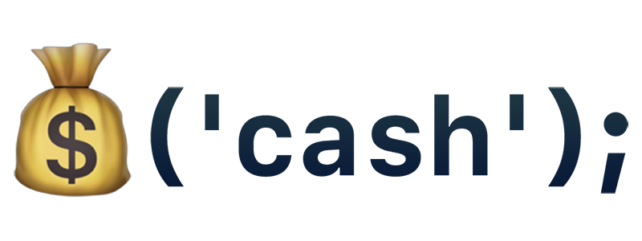

<p align="center">
	
</p>

# Cash

Cash is an absurdly small jQuery alternative for modern browsers (IE10+) that provides jQuery-style syntax for manipulating the DOM. Utilizing modern browser features to minimize the codebase, developers can use the familiar chainable methods at a fraction of the file size. 100% feature parity with jQuery isn't a goal, but cash comes helpfully close, covering most day to day use cases.

## Size Comparison

|                    | Cash        | jQuery 3.3.1 |
| ------------------ | ----------- | ------------ |
| Uncompressed       | **28.7 KB** | 271 KB       |
| Minified           | **11 KB**   | 87 KB        |
| Minified & Gzipped | **4.5 KB**  | 30.3 KB      |

An **85%** gain in size reduction. If you need a smaller bundle, we support [partial builds](https://github.com/kenwheeler/cash/blob/master/docs/partial_builds.md) too.

## Usage

Get cash from [CloudFlare](https://cdnjs.cloudflare.com/ajax/libs/cash/2.3.7/cash.min.js) or [jsDelivr](https://cdn.jsdelivr.net/npm/cash-dom@2.3.7/dist/cash.min.js) and use it like this:

```html
<script src="https://cdnjs.cloudflare.com/ajax/libs/cash/2.3.7/cash.min.js"></script>
<script>
  $(function () {
    $('html').addClass ( 'dom-loaded' );
    $('<footer>Appended with cash</footer>').appendTo ( document.body );
  });
</script>
```

Cash is also available through [npm](http://npmjs.com) as the [`cash-dom`](https://www.npmjs.com/package/cash-dom) package:

```sh
npm install cash-dom --save-dev
```

## Documentation

Cash gives you a query selector, [collection methods](#collection-methods) and some [library methods](#cash-methods). If you need more details about our API just check out [jQuery's](http://api.jquery.com), while we don't implement everything that jQuery provides, everything what we do implement should be compatible with jQuery.

### $()

This is the main selector method for cash. It returns an actionable collection of nodes.

If a function is provided, the function will be run once the DOM is ready.

```js
$( selector [, context] ) // => collection
$(node) // => collection
$(nodeList) // => collection
$(htmlString) // => collection
$(collection) // => self
$(function () {}) // => document ready callback
```

### Collection Methods

These methods from the collection prototype ([$.fn](#fn)) are available once you create a collection with `$()` and are called like so:

```js
$(element).addClass ( className ) // => collection
```

| Attributes                           | Collection                 | CSS                  | Data                               | Dimensions                           | Events                       |
| ------------------------------------ | -------------------------- | -------------------- | ---------------------------------- | ------------------------------------ | ---------------------------- |
| [fn.addClass ()](#fnaddclass-)       | [fn.add ()](#fnadd-)       | [fn.css ()](#fncss-) | [fn.data ()](#fndata-)             | [fn.height ()](#fnheight-)           | [fn.off ()](#fnoff-)         |
| [fn.attr ()](#fnattr-)               | [fn.each ()](#fneach-)     |                      | [fn.removeData ()](#fnremovedata-) | [fn.innerHeight ()](#fninnerheight-) | [fn.on ()](#fnon-)           |
| [fn.hasClass ()](#fnhasclass-)       | [fn.eq ()](#fneq-)         |                      |                                    | [fn.innerWidth ()](#fninnerwidth-)   | [fn.one ()](#fnone-)         |
| [fn.prop ()](#fnprop-)               | [fn.filter ()](#fnfilter-) |                      |                                    | [fn.outerHeight ()](#fnouterheight-) | [fn.ready ()](#fnready-)     |
| [fn.removeAttr ()](#fnremoveattr-)   | [fn.first ()](#fnfirst-)   |                      |                                    | [fn.outerWidth ()](#fnouterwidth-)   | [fn.trigger ()](#fntrigger-) |
| [fn.removeClass ()](#fnremoveclass-) | [fn.get ()](#fnget-)       |                      |                                    | [fn.width ()](#fnwidth-)             |                              |
| [fn.removeProp ()](#fnremoveprop-)   | [fn.index ()](#fnindex-)   |                      |                                    |                                      |                              |
| [fn.toggleClass ()](#fntoggleclass-) | [fn.last ()](#fnlast-)     |                      |                                    |                                      |                              |
|                                      | [fn.map ()](#fnmap-)       |                      |                                    |                                      |                              |
|                                      | [fn.slice ()](#fnslice-)   |                      |                                    |                                      |                              |

| Forms                            | Manipulation                           | Offset                                 | Traversal                      |
| -------------------------------- | -------------------------------------- | -------------------------------------- | ------------------------------ |
| [fn.serialize ()](#fnserialize-) | [fn.after ()](#fnafter-)               | [fn.offset ()](#fnoffset-)             | [fn.children ()](#fnchildren-) |
| [fn.val ()](#fnval-)             | [fn.append ()](#fnappend-)             | [fn.offsetParent ()](#fnoffsetparent-) | [fn.closest ()](#fnclosest-)   |
|                                  | [fn.appendTo ()](#fnappendto-)         | [fn.position ()](#fnposition-)         | [fn.contents ()](#fncontents-)         |
|                                  | [fn.before ()](#fnbefore-)             |                                        | [fn.find ()](#fnfind-)         |
|                                  | [fn.clone ()](#fnclone-)               |                                        | [fn.has ()](#fnhas-)           |
|                                  | [fn.detach ()](#fndetach-)             |                                        | [fn.is ()](#fnis-)             |
|                                  | [fn.empty ()](#fnempty-)               |                                        | [fn.next ()](#fnnext-)         |
|                                  | [fn.html ()](#fnhtml-)                 |                                        | [fn.not ()](#fnnot-)           |
|                                  | [fn.insertAfter ()](#fninsertafter-)   |                                        | [fn.parent ()](#fnparent-)     |
|                                  | [fn.insertBefore ()](#fninsertbefore-) |                                        | [fn.parents ()](#fnparents-)   |
|                                  | [fn.prepend ()](#fnprepend-)           |                                        | [fn.prev ()](#fnprev-)         |
|                                  | [fn.prependTo ()](#fnprependto-)       |                                        | [fn.siblings ()](#fnsiblings-) |                               |
|                                  | [fn.remove ()](#fnremove-)             |                                        |                                |
|                                  | [fn.replaceAll ()](#fnreplaceall-)     |                                        |                                |
|                                  | [fn.replaceWith ()](#fnreplacewith-)   |                                        |                                |
|                                  | [fn.text ()](#fntext-)                 |                                        |                                |

#### $.fn

The main prototype for collections, allowing you to extend cash with plugins by adding methods to all collections.

```js
$.fn // => cash.prototype
$.fn.myMethod = function () {}; // Custom method added to all collections
$.fn.extend ( object ); // Add multiple methods to the prototype
```

#### fn.add ()

Returns a new collection with the element(s) added to the end.

```js
$(element).add ( element ) // => collection
$(element).add ( selector ) // => collection
$(element).add ( collection ) // => collection
```

#### fn.addClass ()

Adds the `className` class to each element in the collection.

Accepts space-separated `className` for adding multiple classes.

```js
$(element).addClass ( className ) // => collection
```

#### fn.after ()

Inserts content or elements after the collection.

```js
$(element).after ( element ) // => collection
$(element).after ( htmlString ) // => collection
$(element).after ( content [, content] ) // => collection
```

#### fn.append ()

Appends content or elements to each element in the collection.

```js
$(element).append ( element ) // => collection
$(element).append ( htmlString ) // => collection
$(element).append ( element [, element] ) // => collection
```

#### fn.appendTo ()

Adds the elements in the collection to the target element(s).

```js
$(element).appendTo ( element ) // => collection
```

#### fn.attr ()

Without attrValue, returns the attribute value of the first element in the collection.

With attrValue, sets the attribute value of each element of the collection.

```js
$(element).attr ( attrName ) // => AttributeValue
$(element).attr ( attrName, attrValue ) // => collection
```

#### fn.before ()

Inserts content or elements before the collection.

```js
$(element).before ( element ) // => collection
$(element).before ( htmlString ) // => collection
$(element).before ( content [, content] ) // => collection
```

#### fn.children ()

Without a selector specified, returns a collection of child elements.

With a selector, returns child elements that match the selector.

```js
$(element).children () // => collection
$(element).children ( selector ) // => collection
```

#### fn.closest ()

Returns the closest matching selector up the DOM tree.

```js
$(element).closest () // => collection
$(element).closest ( selector ) // => collection
```

#### fn.contents ()

Get the children of each element in the set of matched elements, including text and comment nodes.

Useful for selecting elements in friendly iframes.

```js
$('iframe').contents ().find ( '*' ) // => collection
```

#### fn.clone ()

Returns a clone of the collection.

```js
$(element).clone () // => collection
```

#### fn.detach ()

Removes collection elements from the DOM.

```js
$(element).detach () // => collection
```

#### fn.css ()

Returns a CSS property value when just property is supplied.

Sets a CSS property when property and value are supplied.

Sets multiple properties when an object is supplied.

Properties will be autoprefixed if needed for the user's browser.

```js
$(element).css ( property ) // => value
$(element).css ( property, value ) // => collection
$(element).css ( object ) // => collection
```

#### fn.data ()

Link some data (string, object, array, etc.) to an element when both key and value are supplied.

If only a key is supplied, returns the linked data and falls back to data attribute value if no data is already linked.

Multiple data can be set when an object is supplied.

```js
$(element).data () // => object
$(element).data ( key ) // => value
$(element).data ( key, value ) // => collection
$(element).data ( object ) // => collection
```

#### fn.each ()

Iterates over a collection with `callback ( index, element )`.

```js
$(element).each ( callback ) // => collection
```

#### fn.empty ()

Empties the elements interior markup.

```js
$(element).empty () // => collection
```

#### fn.eq ()

Returns a collection with the element at index.

```js
$(element).eq ( index ) // => collection
```

#### fn.extend ()

Adds properties to the cash collection prototype.

```js
$.fn.extend(object) // => object
```

#### fn.filter ()

Returns the collection that results from applying the filter selector/method.

```js
$(element).filter ( selector ) // => collection
$(element).filter ( function ( index, element ) {} ) // => collection
```

#### fn.find ()

Returns selector match descendants from the first element in the collection.

```js
$(element).find ( selector ) // => collection
```

#### fn.first ()

Returns a collection containing only the first element.

```js
$(element).first () // => collection
```

#### fn.get ()

Returns the element at the index, or returns all elements.

```js
$(element).get ( index ) // => domNode
$(element).get () // => domNode[]
```

#### fn.has ()

Reduce the set of matched elements to those that have a descendant that matches the selector or DOM element.

```js
$(element).has ( selector ) // => collection
$(element).has ( element ) // => collection
```

#### fn.hasClass ()

Returns the boolean result of checking if the first element in the collection has the `className` attribute.

```js
$(element).hasClass ( className ) // => boolean
```

#### fn.height ()

Returns or sets the height of the element.

```js
$(element).height () // => Integer
$(element).height ( number ) // => collection
```

#### fn.html ()

Returns the HTML text of the first element in the collection, sets the HTML if provided.

```js
$(element).html () // => HTML Text
$(element).html ( htmlString ) // => HTML Text
```

#### fn.index ()

Returns the index of the element in its parent if an element or selector isn't provided. Returns index within element or selector if it is.

```js
$(element).index () // => Integer
$(element).index ( element ) // => Integer
```

#### fn.innerHeight ()

Returns the height of the element + padding.

```js
$(element).innerHeight () // => Integer
```

#### fn.innerWidth ()

Returns the width of the element + padding.

```js
$(element).innerWidth () // => Integer
```

#### fn.insertAfter ()

Inserts collection after specified element.

```js
$(element).insertAfter ( element ) // => collection
```

#### fn.insertBefore ()

Inserts collection before specified element.

```js
$(element).insertBefore ( element ) // => collection
```

#### fn.is ()

Returns whether the provided selector, element or collection matches any element in the collection.

```js
$(element).is ( selector ) // => boolean
```

#### fn.last ()

Returns a collection containing only the last element.

```js
$(element).last () // => collection
```

#### fn.map ()

Returns a new collection, mapping each element with `callback ( index, element )`.

```js
$(selector).map ( callback ) // => collection
```

#### fn.next ()

Returns next sibling.

```js
$(element).next () // => collection
```

#### fn.not ()

Filters collection by false match on collection/selector.

```js
$(element).not ( selector ) // => collection
$(element).not ( collection ) // => collection
```

#### fn.off ()

Removes event listener from collection elements.

Accepts space-separated eventName for removing multiple events listeners.

Removes all event listeners if called without arguments.

```js
$(element).off ( eventName, eventHandler ) // => collection
$(element).off ( eventName ) // => collection
$(element).off () // => collection
```

#### fn.offset ()

Get the coordinates of the first element in a collection relative to the document.

```js
$(element).offset () // => Object
```

#### fn.offsetParent ()

Get the first element's ancestor that's positioned.

```js
$(element).offsetParent () // => collection
```

#### fn.on ()

Adds event listener to collection elements.

Accepts space-separated eventName for listening to multiple events.

Event is delegated if delegate is supplied.

```js
$(element).on ( eventName, eventHandler ) // => collection
$(element).on ( eventName, delegate, eventHandler ) // => collection
```

#### fn.one ()

Adds event listener to collection elements that only triggers once for each element.

Accepts space-separated eventName for listening to multiple events.

Event is delegated if delegate is supplied.

```js
$(element).one ( eventName, eventHandler ) // => collection
$(element).one ( eventName, delegate, eventHandler ) // => collection
```

#### fn.outerHeight ()

Returns the outer height of the element. Includes margins if `includeMargings` is set to true.

```js
$(element).outerHeight () // => Integer
$(element).outerHeight ( includeMargins ) // => Integer
```

#### fn.outerWidth ()

Returns the outer width of the element. Includes margins if `includeMargings` is set to true.

```js
$(element).outerWidth () // => Integer
$(element).outerWidth ( includeMargins ) // => Integer
```

#### fn.parent ()

Returns parent element.

```js
$(element).parent() // => collection
```

#### fn.parents ()

Returns collection of elements who are parents of element. Optionally filtering by selector.

```js
$(element).parents () // => collection
$(element).parents ( selector ) // => collection
```

#### fn.position ()

Get the coordinates of the first element in a collection relative to its `offsetParent`.

```js
$(element).position () // => object
```

#### fn.prepend ()

Prepends content or elements to the each element in collection.

```js
$(element).prepend ( element ) // => collection
$(element).prepend ( htmlString ) // => collection
$(element).prepend ( content [, content] ) // => collection
```

#### fn.prependTo ()

Prepends elements in a collection to the target element(s).

```js
$(element).prependTo ( element ) // => collection
```

#### fn.prev ()

Returns the previous adjacent element.

```js
$(element).prev () // => collection
```

#### fn.prop ()

Returns a property value when just property is supplied.

Sets a property when property and value are supplied, and sets multiple properties when an object is supplied.

```js
$(element).prop ( property ) // => property value
$(element).prop ( property, value ) // => collection
$(element).prop ( object ) // => collection
```

#### fn.ready ()

Calls callback method on DOMContentLoaded.

```js
$(document).ready ( callback ) // => collection/span
```

#### fn.remove ()

Removes collection elements from the DOM and removes all their event listeners.

```js
$(element).remove () // => collection
```

#### fn.replaceAll ()

This is similar to [fn.replaceWith()](#fnreplacewith-), but with the source and target reversed.

```js
$(element).replaceAll ( content ) // => collection
```

#### fn.replaceWith ()

Replace collection elements with the provided new content.

```js
$(element).replaceWith ( content ) // => collection
```

#### fn.removeAttr ()

Removes attribute from collection elements.

Accepts space-separated attrName for removing multiple attributes.

```js
$(element).removeAttr ( attrName ) // => collection
```

#### fn.removeClass ()

Removes className from collection elements.

Accepts space-separated className for adding multiple classes.

Providing no arguments will remove all classes.

```js
$(element).removeClass () // => collection
$(element).removeClass ( className ) // => collection
```

#### fn.removeData ()

Removes linked data and data-attributes from collection elements.

```js
$(element).removeData ( name ) // => collection
$(element).removeData () // => collection
```

#### fn.removeProp ()

Removes property from collection elements.

```js
$(element).removeProp ( propName ) // => collection
```

#### fn.serialize ()

When called on a form, serializes and returns form data.

```js
$(form).serialize () // => String
```

#### fn.siblings ()

Returns a collection of sibling elements.

```js
$(element).siblings () // => collection
```

#### fn.slice ()

Returns a new collection with elements taken from start to end.

```js
$(selector).slice ( start, end ) // => collection
```

#### fn.text ()

Returns the inner text of the first element in the collection, sets the text if textContent is provided.

```js
$(element).text () // => text
$(element).text ( textContent ) // => collection
```

#### fn.toggleClass ()

Adds or removes className from collection elements based on if the element already has the class.

Accepts space-separated classNames for toggling multiple classes, and an optional `force` boolean to ensure classes are added (`true`) or removed (`false`).

```js
$(element).toggleClass ( className ) // => collection
$(element).toggleClass ( className, force ) // => collection
```

#### fn.trigger ()

Triggers supplied event on elements in collection. Data can be passed along as the second parameter.

```js
$(element).trigger ( eventName ) // => collection
$(element).trigger ( eventObj ) // => collection
$(element).trigger ( eventName, data ) // => collection
$(element).trigger ( eventObj, data ) // => collection
```

#### fn.val ()

Returns an inputs value. If value is supplied, sets all inputs in collection's value to the value argument.

```js
$(input).val () // => value
$(input).val ( value ) // => collection
```

#### fn.width ()

Returns or sets the width of the element.

```js
$(element).width () // => number
$(element).width ( number ) // => collection
```

### Cash Methods

These methods are exported from the global `$` object, and are called like so:

```js
$.isString ( str ) // => boolean
```

| Type Checking                   | Utilities                           |
| ------------------------------- | ----------------------------------- |
| [$.isArray ()](#isarray-)       | [$.guid](#guid)                     |
| [$.isFunction ()](#isfunction-) | [$.camelCase ()](#camelcase-)       |
| [$.isNumeric ()](#isnumeric-)   | [$.each ()](#each-)                 |
| [$.isString ()](#isstring-)     | [$.extend ()](#extend-)             |
|                                 | [$.hasData ()](#hasdata-)             |
|                                 | [$.matches ()](#matches-)           |
|                                 | [$.parseHTML ()](#parsehtml-)       |
|                                 | [$.prefixedProp ()](#prefixedprop-) |
|                                 | [$.unique ()](#unique-)             |

#### $.guid

A unique number.

```js
$.guid++ // => number
```

#### $.camelCase ()

Transforms a string to camelCase.

```js
$.camelCase ( 'border-width' ) // => 'borderWidth'
```

#### $.each ()

Iterates through an array and calls the `callback ( value, index, array )` method on each.

```js
$.each ( array, callback ) // => undefined
```

#### $.extend ()

Extends target object with properties from the source object. If no target is provided, cash itself will be extended.

```js
$.extend ( target, source ) // => object
```

#### $.hasData ()

Determine whether an element has any cash data associated with it.

```js
$.hasData ( document.body ) // => boolean
```

#### $.isArray ()

Check if the argument is an array.

```js
$.isArray ([ 1, 2, 3 ]) // => true
```

#### $.isFunction ()

Check if the argument is a function.

```js
function fn () {};
$.isFunction ( fn ) // => true
```

#### $.isNumeric ()

Check if the argument is numeric.

```js
$.isNumeric ( 57 ) // => true
```

#### $.isString ()

Check if the argument is a string.

```js
$.isString ( 'hello' ) // => true
```

#### $.matches ()

Checks a selector against an element, returning a boolean value for match.

```js
$.matches ( element, selector ) // => boolean
```

#### $.parseHTML ()

Returns a collection from an HTML string.

```js
$.parseHTML ( htmlString ) // => collection
```

#### $.prefixedProp ()

Return a prefixed CSS property, if necessary.

```js
$.prefixedProp ( 'transform' ) // => 'mozTransform'
```

#### $.unique ()

Returns a new array with duplicates removed.

```js
$.unique ( array ) // => array
```

## Contributing

If you found a problem, or have a feature request, please open an [issue](https://github.com/kenwheeler/cash/issues) about it.

If you want to make a pull request you should:

1. Clone the repository: `git clone https://github.com/kenwheeler/cash.git`.
2. Enter the cloned repository: `cd cash`
3. Install the dependencies: `npm install`.
4. Automatically recompile cash whenever a change is made: `npm run dev`.
5. Automatically rerun the tests whenever a change is made: `npm run test:watch`.
6. Remember to update the readme, if necessary.

## Thanks

- **[@hisk](https://github.com/hisk)** - The "design focused engineer" behind our awesome logo.
- **[Sauce Labs](https://saucelabs.com)** - The cross-browser testing platform we use for testing our builds in all the supported environments.

## License

MIT © Ken Wheeler
